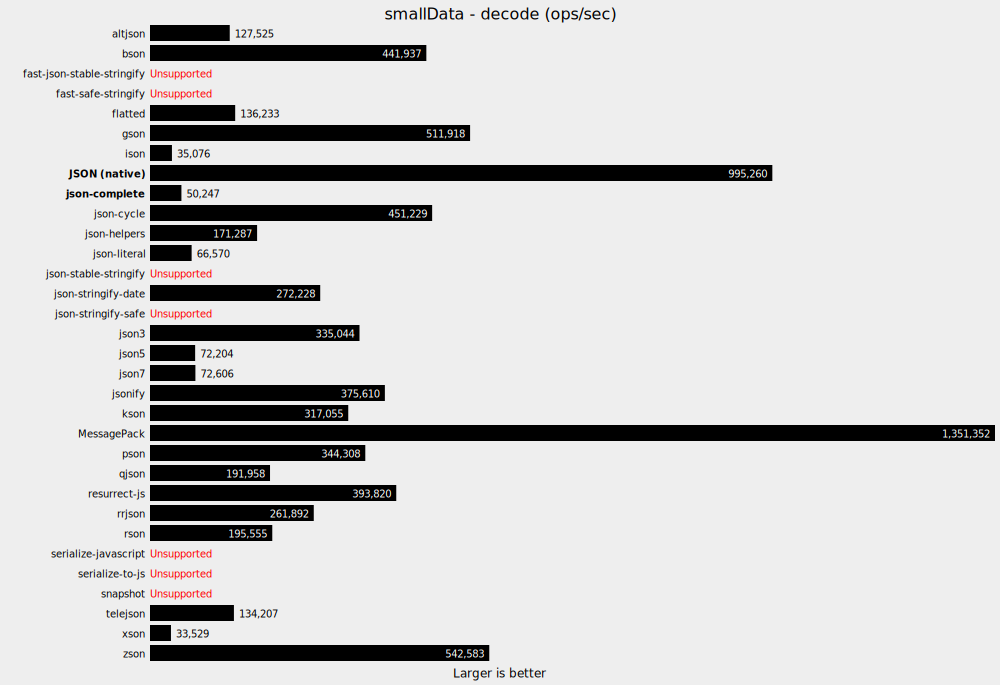
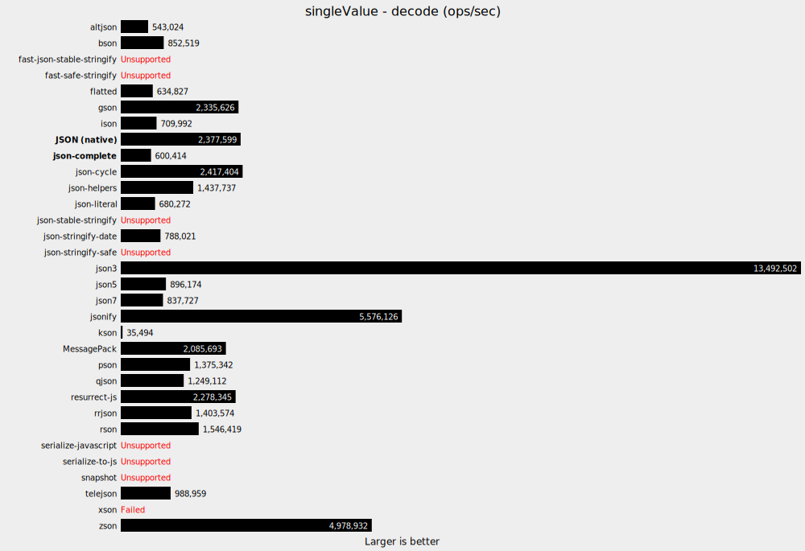
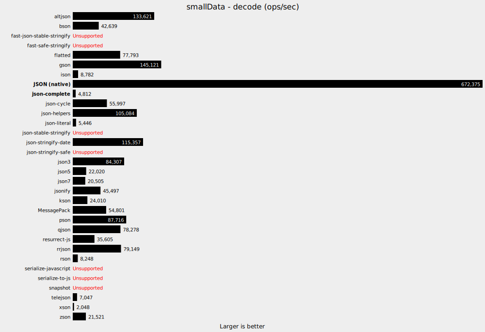
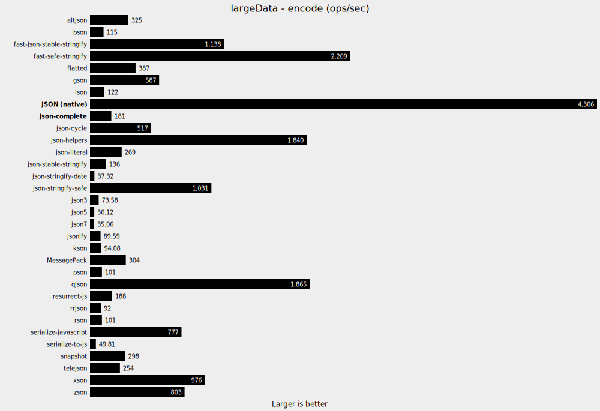

# Benchmarks

Here we compare relative speed for encoding and decoding various types of data in various libraries. For details about the data tested and the methods of benchmarking, please see [this repository](https://github.com/dwighthouse/json-complete-benchmarking).

* All tests run on:
  - **MacBook Pro (15-inch, 2017)**
  - macOS High Sierra (10.13.6)
  - 2.9 GHz Intel Core i7
  - 16 GB 2133 MHz LPDDR3
* Relative results can vary wildly, for various reasons, in different environments and for different types of data.
* Some libraries tested did not include a decode/parse option, but only sought to create JSON-compatible text in a different or more stable way.
* One library (xson) errored out when decoding some data.
* The native JSON implementation seems to be consistently very fast, though typically the most limited.
* json-complete, while typically towards the bottom of ops/second among these libraries, is never the slowest library except in one case (Node, encoding single value data).
  - This isn't unexpected, as it probably has the most features and has not been optimized for performance.

Links to all tested libraries below.

## Node (11.4.0) - [Data](./NodeRun.json)

### encode singleValue

### decode singleValue

### encode smallData

### decode smallData

### decode largeData

### encode largeData

## Google Chrome (76) - [Data](./ChromeRun.json)

### encode singleValue

### decode singleValue

### encode smallData

### decode smallData

### decode largeData

### encode largeData

## Firefox (68) - [Data](./FirefoxRun.json)

### encode singleValue

### decode singleValue

### encode smallData

### decode smallData

### decode largeData

### encode largeData

## Library Links

* JSON (native) - Built-in
* [@msgpack/msgpack](https://www.npmjs.com/package/@msgpack/msgpack)
* [altjson](https://www.npmjs.com/package/altjson)
* [bson](https://www.npmjs.com/package/bson)
* [coffeescript](https://www.npmjs.com/package/coffeescript)
* [fast-json-stable-stringify](https://www.npmjs.com/package/fast-json-stable-stringify)
* [fast-safe-stringify](https://www.npmjs.com/package/fast-safe-stringify)
* [flatted](https://www.npmjs.com/package/flatted)
* [gson](https://www.npmjs.com/package/gson)
* [ison](https://www.npmjs.com/package/ison)
* [json-complete](https://www.npmjs.com/package/json-complete)
* [json-cycle](https://www.npmjs.com/package/json-cycle)
* [json-helpers](https://www.npmjs.com/package/json-helpers)
* [json-literal](https://www.npmjs.com/package/json-literal)
* [json-stable-stringify](https://www.npmjs.com/package/json-stable-stringify)
* [json-stringify-date](https://www.npmjs.com/package/json-stringify-date)
* [json-stringify-safe](https://www.npmjs.com/package/json-stringify-safe)
* [json3](https://www.npmjs.com/package/json3)
* [json5](https://www.npmjs.com/package/json5)
* [json7](https://www.npmjs.com/package/json7)
* [jsonify](https://www.npmjs.com/package/jsonify)
* [kson](https://www.npmjs.com/package/kson)
* [pson](https://www.npmjs.com/package/pson)
* [qjson](https://www.npmjs.com/package/qjson)
* [resurrect-js](https://www.npmjs.com/package/resurrect-js)
* [rrjson](https://www.npmjs.com/package/rrjson)
* [rson](https://www.npmjs.com/package/rson)
* [serialize-javascript](https://www.npmjs.com/package/serialize-javascript)
* [serialize-to-js](https://www.npmjs.com/package/serialize-to-js)
* [snapshot](https://www.npmjs.com/package/snapshot)
* [telejson](https://www.npmjs.com/package/telejson)
* [xson](https://www.npmjs.com/package/xson)
* [zson](https://www.npmjs.com/package/zson)
